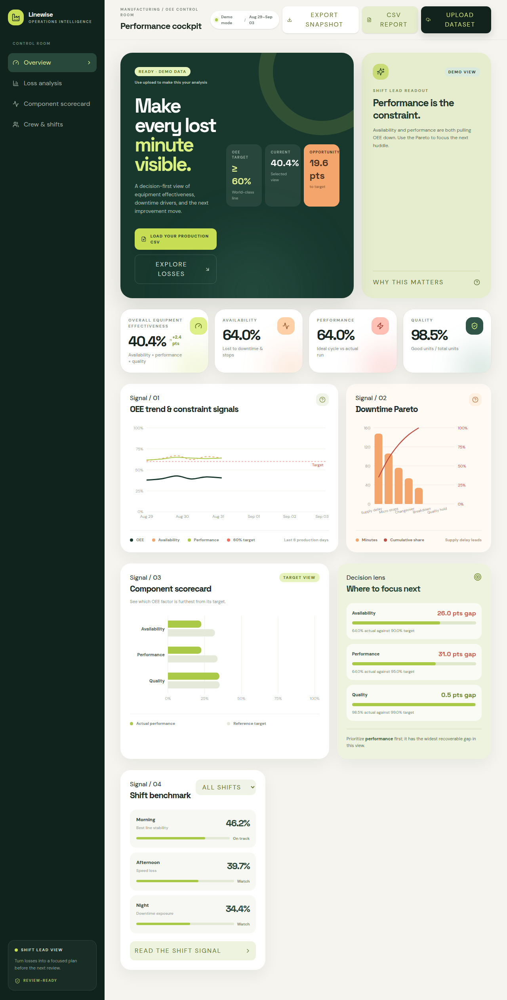

# OEE Dashboard

A decision-oriented manufacturing performance dashboard for OEE and loss analysis. The experience combines operational KPIs, constraint signals, loss concentration, target gaps, and shift benchmarking in a responsive control-room layout.



## Overview

The dashboard is designed to make production losses easier to see and easier to act on. It begins with the overall equipment effectiveness signal and its three constituent factors—availability, performance, and quality—then moves from trend context to downtime concentration, component target gaps, and crew-level benchmarking.

The default view uses clearly labeled demonstration data. Users can load a production CSV directly in the browser; the dashboard maps common availability, performance, quality, downtime, defect, and loss-cause fields into the visual model without requiring a server-side data pipeline.

## Visualization report

| Area | Visualization | Decision supported |
| --- | --- | --- |
| OEE trend | Multi-line trend for OEE, availability, and performance with a 60% target reference line | Detect whether the line is improving and which constraint is moving with it |
| Downtime losses | Pareto bars with cumulative loss-share line | Focus the next improvement cycle on the few causes creating the most visible loss |
| Component scorecard | Horizontal actual-versus-target comparison for availability, performance, and quality | Identify the largest recoverable gap instead of treating OEE as one opaque number |
| Decision lens | Gap cards with progress bars and a ranked focus recommendation | Translate the scorecard into a practical next focus area |
| Shift benchmark | Shift-level OEE cards with status indicators and a filter | Separate line-level problems from crew, handoff, or shift-pattern effects |

## Key interaction model

The sidebar provides anchors for Overview, Loss analysis, Component scorecard, and Crew & shifts. The dashboard supports a mobile navigation drawer, dataset upload, CSV validation feedback, browser-side metric calculation, snapshot export, and a dedicated **CSV report** button. After a CSV is loaded, the button downloads a Markdown report named for that file with the calculated KPI table, Mermaid component and loss visuals, cumulative Pareto data, and a recommended focus area. The desktop hero uses a dedicated right-hand metric rail so target, current, and opportunity cards stay aligned without covering the headline or upload controls.

## Design system

The interface uses a warm manufacturing control-room palette: deep evergreen for navigation and high-salience surfaces, lime for positive signal and targets, apricot for loss emphasis, coral for risk, and a soft cream canvas for reduced visual fatigue. Space Grotesk provides display hierarchy, while DM Sans and DM Mono support readable operational labels and compact data annotations.

Cards use soft depth, generous rounding, restrained borders, and small motion cues rather than dense dashboard chrome. Charts share consistent axis treatment, target references, direct legends, and contextual tooltips so the visual language remains legible across desktop and mobile widths.

## Technical implementation

The project is a React 19 and TypeScript frontend built with Vite and Tailwind CSS. Recharts powers the analytical visualizations, while Lucide provides the interface iconography. The application is static-first and keeps CSV parsing and metric derivation in the browser.

### Project structure

| Path | Purpose |
| --- | --- |
| `client/src/pages/Home.tsx` | Dashboard layout, metrics, interactions, CSV mapping, and charts |
| `client/src/index.css` | Typography, palette, layout primitives, responsive rules, and motion styling |
| `client/index.html` | Page shell and `OEE Dashboard` document title |
| `docs/dashboard-preview.png` | Full-page visual preview used in this report |
| `package.json` | Development, type-check, and production-build scripts |

## Local development

```bash
pnpm install
pnpm dev
```

The production checks used for this release are:

```bash
pnpm check
pnpm build
```

The dashboard accepts `.csv` files from the upload controls. A header row and at least one data row are required. When fields are available, the mapper recognizes common names such as `availability`, `performance`, `quality`, `quality_score`, `defect_rate`, `downtime_minutes`, `downtime_percentage`, `downtime_cause`, `downtime_type`, `cause`, and `reason`. The **CSV report** action remains disabled until a file is loaded, preventing a report from being generated without a specific source dataset.

## Release validation

The current release has passed TypeScript validation and the Vite production build. The responsive preview was checked at desktop and mobile widths. The public repository contains a clean release history with the dashboard source, configuration, and documentation assets.

## Repository

This project is maintained in the public repository [Robi46/oee-downtime-dashboard-visuals](https://github.com/Robi46/oee-downtime-dashboard-visuals).
